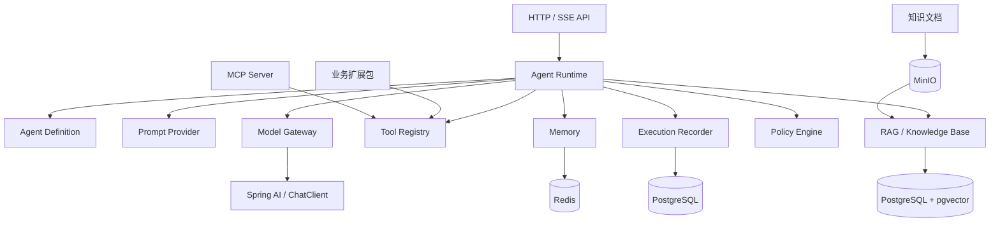

# Agent Platform

一个面向多业务场景的可扩展通用 Agent 平台。

项目目标不是为某个固定业务开发专用 Agent，而是提供统一的 Agent Runtime。平台通过动态加载不同业务的 Tool、知识、Prompt、规则和权限，在不修改核心架构的情况下切换为电商 Agent、运维 Agent、HR Agent、项目管理 Agent 等不同形态。

## 核心目标

- 统一管理大模型交互、Prompt、Tool Calling、Memory、RAG、Advisor 和 MCP。
- Agent Core 不依赖具体业务系统，也不写死电商、运维或 HR 业务逻辑。
- 业务能力通过扩展包、Adapter 或 MCP Server 接入。
- 对模型调用、工具调用、知识检索和权限判断提供统一的执行记录与审计能力。
- 支持根据 Agent 定义动态组合模型、Prompt、工具、知识库、记忆和权限策略。

## 总体架构



核心调用链：

```text
HTTP 请求
    → AgentController
    → AgentRuntime
    → AgentDefinitionProvider
    → PromptProvider
    → ModelGateway
    → Spring AI ChatClient
```

## 模块结构

```text
agent-platform
├── agent-core
│   └── 通用领域模型、Agent Runtime 和扩展端口
└── agent-server
    └── Spring Boot 服务、HTTP API 和基础设施 Adapter
```

依赖方向固定为：

```text
agent-server → agent-core
```

`agent-core` 不依赖 Spring AI、Web、数据库或具体业务系统。

## 技术栈

### 当前已引入

| 分类 | 技术 | 用途 |
|---|---|---|
| 开发语言 | Java 21 | 平台主要开发语言 |
| 项目构建 | Maven | 多模块构建和依赖管理 |
| 应用框架 | Spring Boot 4.1.1 | 服务启动、配置和依赖装配 |
| AI 框架 | Spring AI 2.0.1 | ChatClient、模型抽象及后续 Tool、Memory、RAG、Advisor、MCP 接入 |
| 模型协议 | OpenAI / OpenAI-Compatible API | 对接 OpenAI 及兼容模型服务 |
| Web | Spring Web MVC | REST API 和后续 SSE 流式接口 |
| 参数校验 | Jakarta Validation | HTTP 请求参数校验 |
| 代码简化 | Lombok | 生成数据类方法和依赖注入构造器 |

### 计划接入

| 能力 | 推荐技术 | 用途 |
|---|---|---|
| 主数据库 | PostgreSQL | Agent、Prompt、会话、完整消息、权限、执行记录和审计数据 |
| 数据库迁移 | Flyway | 数据库表结构版本管理，禁止依赖生产环境自动建表 |
| 数据访问 | Spring Data JDBC | 关系数据访问，保持持久化对象与 Core 对象分离 |
| 缓存与短期记忆 | Redis + Spring Data Redis | Chat Memory、缓存、幂等、限流、分布式锁和短期运行状态 |
| 向量检索 | pgvector + Spring AI PgVectorStore | 文档切片向量和 RAG 相似度检索 |
| 对象存储 | MinIO / S3 | PDF、Word、图片等知识文档原文件 |
| 身份与权限 | Spring Security + OAuth2 Resource Server / JWT | 用户认证、Agent 使用权限和 Tool 数据权限 |
| MCP | Spring AI MCP Client / Server | 发现并调用外部 MCP Tool、Resource 和 Prompt |
| 可观测性 | Spring Boot Actuator + Micrometer + OpenTelemetry | 指标、Trace、模型调用和 Tool 调用链路观测 |
| 监控 | Prometheus + Grafana | 运行指标采集与展示 |
| 日志 | Logback + Loki 或 ELK | 应用日志检索和问题排查 |
| 接口文档 | OpenAPI | API 定义、调试和前后端协作 |
| 部署 | Docker / Docker Compose | 本地和测试环境标准化部署 |
| 异步任务（按需） | RabbitMQ 或 Kafka | 文档解析、Embedding、长任务和执行事件解耦 |
| 测试（后续） | JUnit 5 + Mockito + Testcontainers | 单元测试和基础设施集成测试 |

## 存储职责

Redis 不是平台的主数据库。不同类型的数据按照生命周期和查询方式分别存储：

| 存储 | 数据类型 | 是否作为永久事实来源 |
|---|---|---|
| PostgreSQL | Agent、Prompt 版本、用户权限、会话、完整消息、执行记录、Tool 调用记录、知识库元数据 | 是 |
| Redis | 最近对话上下文、缓存、幂等 Key、限流计数、分布式锁、临时执行状态 | 否 |
| PostgreSQL + pgvector | 文档切片、Embedding 向量、检索元数据 | 是 |
| MinIO / S3 | 原始知识文档和附件 | 是 |

需要明确区分：

```text
Chat Memory
= 发送给模型的有限上下文，可被裁剪或过期

Chat History
= 平台需要长期保存的完整消息和审计记录
```

完整聊天历史保存在 PostgreSQL；Redis 只承担短期 Memory 和运行时加速。

## 规划中的核心能力

### Agent Runtime

- 根据 `agentId` 加载 AgentDefinition。
- 动态组合 Prompt、模型、Tool、Memory、RAG 和权限策略。
- 为每次运行生成 executionId。
- 记录模型调用、工具调用、检索和权限判断步骤。

### Prompt 管理

- Prompt ID 和版本管理。
- System Prompt 与模板变量。
- 发布、回滚和启停。
- Agent 与 Prompt 版本绑定。

### Tool 与业务扩展

- Tool 统一描述、发现、注册和调用。
- 根据 Agent 和用户权限动态筛选 Tool。
- 支持本地 Spring Bean、业务 Adapter 和 MCP Tool。
- 电商、ERP、运维、HR 等能力作为独立扩展接入。

### Memory

- 短期对话窗口。
- 完整聊天历史持久化。
- 对话摘要和长期记忆。
- Memory 与用户、Agent、会话隔离。

### RAG

- 文档上传、解析、切片和 Embedding。
- 知识库与 Agent 绑定。
- 文档级和数据级权限过滤。
- 检索来源与引用返回。

### 权限与审计

- 用户是否可以使用某个 Agent。
- 用户是否可以调用某个 Tool。
- Tool 是否可以访问目标业务数据。
- Prompt、模型、检索、Tool 和最终结果的执行审计。

## 实施阶段

1. **最小 Runtime**：AgentDefinition、PromptProvider、ModelGateway、ChatClient Adapter 和统一 API。
2. **持久化**：接入 PostgreSQL、Flyway，保存 Agent、Prompt、Session、Message 和 Execution。
3. **Tool 与 Memory**：实现 ToolRegistry、权限检查、Redis Chat Memory 和执行步骤记录。
4. **RAG**：接入 MinIO、文档处理、Embedding 和 pgvector。
5. **MCP 与业务扩展**：动态加载 MCP Tool 和业务扩展包。
6. **生产能力**：认证授权、限流、可观测性、告警和容器化部署。

## 当前进度

- [x] Maven 多模块骨架
- [x] Agent Core 与 Server 依赖边界
- [x] AgentDefinition 和 AgentRuntime
- [x] PromptProvider 和 ModelGateway
- [x] Spring AI ChatClient Adapter
- [x] 通用 Agent REST API
- [ ] PostgreSQL 持久化
- [ ] Redis Chat Memory
- [ ] Tool Calling 与 Tool Registry
- [ ] 执行记录
- [ ] RAG 与知识库
- [ ] MCP
- [ ] 权限控制与审计
- [ ] 可观测性

## 本地运行

首次运行前创建 PostgreSQL 数据库，并通过环境变量提供密码：

```powershell
$env:AGENT_PLATFORM_DB_PASSWORD = '<你的 PostgreSQL 密码>'
$env:OPENAI_API_KEY = '<你的 OpenAI API Key>'
```

默认连接为 `jdbc:postgresql://localhost:5432/agent_platform`，用户名为 `postgres`。如需覆盖，可设置
`AGENT_PLATFORM_DB_URL` 和 `AGENT_PLATFORM_DB_USERNAME`。数据库变更统一放在
`agent-server/src/main/resources/db/migration`，由 Flyway 在启动时执行。

### 环境要求

- JDK 21
- Maven 3.9+
- 可用的 OpenAI 或 OpenAI-Compatible 模型服务

### 环境变量

```powershell
$env:OPENAI_API_KEY="your-api-key"
$env:OPENAI_MODEL="gpt-4o-mini"
```

### 启动服务

```powershell
# 先构建并安装父工程、Core 和 Server 模块。
mvn -q "-DskipTests" install

# 只启动包含 Spring Boot 主类的 Server 模块。
mvn -f agent-server/pom.xml spring-boot:run
```

### 调用 Agent

```http
POST /api/v1/agents/general-agent/runs
Content-Type: application/json

{
  "sessionId": "session-001",
  "userId": "user-001",
  "message": "介绍一下 Agent Runtime",
  "variables": {}
}
```

也可以把路径中的 `general-agent` 修改为 `code-agent`，使用相同 Runtime 加载不同的 Agent 和 Prompt。

## OpenAPI 接口文档

服务启动后可以通过以下地址查看或获取接口文档：

| 文档 | 地址 |
|---|---|
| Swagger UI | `http://localhost:8090/swagger-ui.html` |
| OpenAPI JSON | `http://localhost:8090/v3/api-docs` |
| OpenAPI YAML | `http://localhost:8090/v3/api-docs.yaml` |

Swagger UI 支持直接填写参数并调试接口。生产环境应根据部署安全要求关闭文档端点，或通过认证和网络策略限制访问。
